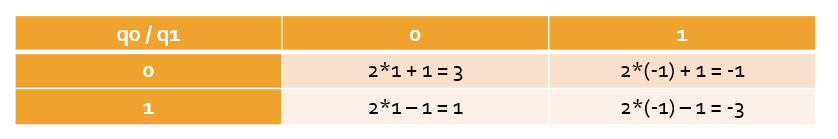

# Corrección de ruido parametrizado en Codificación Superdensa y  Teleportación Cuántica empleando Tensorflow Quantum

__Guillermo García Patiño Lenza__

[toc]


## 1) Objetivo:

El objetivo de este proyecto es aprender a emplear Tensorflow Quantum para corregir ruido parametrizado en los circuitos que implementan la codificación superdensa y la teleportación cuántica empleando una red neuronal. 

Además, se ha implementado otro modelo que es capaz de aprender las rotaciones en el eje Z y en el eje X necesarias para implementar la codificación superdensa. 

## 2) Producción de los circuitos cuánticos necesarios:

En primer lugar es necesario mencionar que para que Tensorflow Quantum sea capaz de integrar circuitos cuánticos en las redes neuronales que construye, es necesario que estos circuitos cumplan los siguientes requisitos:

 - Que los qubits se generen usando 'GridQubit'
 - Que los parámetros a los que cualquier componente de Tensorflow Quantum necesite acceder se implementen con la librería 'sympy'

 Además, es conveniente aclarar que Cirq permite colocar puertas que roten un ángulo específico en torno a alguno de los ejes, pues de esta manera es como se ha implementado el ruido parametrizado en los circuitos.

Atendiendo a lo explicado en la conferencia sobre corrección de errores cuánticos, solo se han introducido rotaciones parametrizadas en torno al eje X y en torno al eje Z, representando los errores de bit-flip y phase-flip. 

Cirq tiene un mecanismo para implementar estos errores que se denominan 'Channel'. Estos se comportan como objetos parametrizados por un valor ρ que representa la probabilidad con la que se produce este error.

A pesar de que Tensorflow Quantum no es capaz de integrar estos mecanismos dentro de las redes neuronales que produce, aún se puede implementar el ruido parametrizado como puertas de rotación en torno al eje X y al eje Z un ángulo fijo θ que se pasa como parámetro.

Teniendo en cuenta todo esto, se han implementado las funciones 'prodTelepRyC' , 'prodCodifDensaRyC' y 'producirCodifDensaGuess'. Las tres producen un circuito cuántico diferente y devuelven:

 - El circuito resultante en el primer parámetro
 - Referencias a todos los qubits del circuito en el segundo parámetro
 - Una lista con dos elementos en la que:
    - El primero es la fracción del circuito resultante desde el comienzo hasta justo antes de que aparezca el primer parámetro de sympy
    - El segundo es la fracción restante del circuito resultante

Esta forma de devolver el resultado se aprovechará a la hora de construir la red neuronal que se entrenará para obtener valores óptimos para los parámetros de sympy.

A continuación se habla de los parámetros que recibe cada función:

 - 'prodTelepRyC' recibe en gradoX y en gradoZ el ángulo en radianes que se quiere hacer rotar al qubit en cuestión para simular el ruido y en q0val un 1 o un 0 que se codificará en el qubit de Alice para ser teleportado al de Bob
 - 'prodCodifDensaRyC' recibe en gradoX y en gradoZ lo mismo que la función anterior, en b1 y b0 un número binario entre 0 y 3 (siendo b1 el bit más significativo) para realizar la codificación superdensa
 - 'prodCodifDensaGuess' solo recibe un parámetro params del que se hablará a continuación

Además, todas las funciones descritas anteriormente reciben en params una lista de parámetros de sympy para las puertas X y Z que tratarán de corregir el ruido parametrizado. En params[0] se encuentra el parámetro correspondiente a la puerta X y en params[1] el que se empleará en la puerta Z.

Dicho esto, se presentan ahora los códigos de las funciones anteriormente comentadas.

```python
def prodTelepRyC(gradoX, gradoZ, q0val, params):

    # q0 contiene el estado que se quiere enviar
    # q1 es el qubit de Alice
    # q2 es el qubit de Bob

    q0,q1,q2 = cq.GridQubit.rect(1,3)

    mIni = []

    # Se prepara q0 en el estado deseado
    if(q0val == 1):
        mIni.append(cq.Moment([cq.X(q0)]))

    # Entrelazo q1 y q2
    m1 = cq.Moment([cq.H(q1)])
    mIni.append(m1)
    m2 = cq.Moment([cq.CNOT(q1,q2)])
    mIni.append(m2)

    circuitoBase = cq.Circuit(mIni)

    # Codificar el estado de q0 en q1
    circuitoBase.append(cq.CNOT(q0,q1))
    circuitoBase.append(cq.H(q0))

    # Se inserta el ruido a la hora de enviar el bit
    circuitoBase.append(cq.rx(gradoX).on(q1))
    circuitoBase.append(cq.rz(gradoZ).on(q1))

    # Se insertan puertas X y Z para corregir el ruido
    circuitoBase.append(cq.rx(params[0]).on(q1))
    circuitoBase.append(cq.rz(params[1]).on(q1))

    # Decodificar el estado de q0
    circuitoBase.append(cq.CNOT(q1,q2))    
    circuitoBase.append(cq.CZ(q0,q2))
    
    # medir
    circuitoBase.append([cq.measure(q0), cq.measure(q1), cq.measure(q2)])

    me = []
    if (q0val == 1):
        me.append(cq.Moment([cq.X(q0)]))
    me.append(m1)
    me.append(m2)

    me1 = cq.Moment([cq.CNOT(q0,q1)])
    me.append(me1)
    me2 = cq.Moment([cq.H(q0)])
    me.append(me2)
    me3 = cq.Moment([cq.rx(gradoX).on(q1)])
    me.append(me3)
    me4 = cq.Moment([cq.rz(gradoZ).on(q1)])
    me.append(me4)
    circuitoEntrada = cq.Circuit(me)

    mc1 = cq.Moment([cq.rx(params[0]).on(q1)])
    mc2 = cq.Moment([cq.rz(params[1]).on(q1)])
    mc3 = cq.Moment([cq.CNOT(q1,q2)])
    mc4 = cq.Moment([cq.CZ(q0,q2)])
    mc5 = cq.Moment([cq.measure(q0), cq.measure(q1), cq.measure(q2)])
    circuitoControlado = cq.Circuit([mc1,mc2,mc3,mc4,mc5])

    return circuitoBase, [q0,q1,q2], [circuitoEntrada, circuitoControlado]
```

```python
def prodCodifDensaRyC(gradoX, gradoZ, params,b1,b0):
    #construir la primera parte del circuito

    q0, q1 = cq.GridQubit.rect(1,2)

    ent1 = cq.Moment(cq.H(q0))
    ent2 = cq.Moment([cq.CNOT(q0,q1)])

    circuitBase = cq.Circuit((ent1,ent2))

    # añadirle la parte que realiza la codificacion superdensa
    l = []
    if (b1 == 0 and b0 == 1):
        circuitBase.append(cq.X(q0))
        l.append(cq.Moment([cq.X(q0)]))
    elif (b1 == 1 and b0 == 0):
        circuitBase.append(cq.Z(q0))
        l.append(cq.Moment([cq.Z(q0)]))
    elif (b1 == 1 and b0 == 1):
        circuitBase.append(cq.X(q0))
        circuitBase.append(cq.Z(q0))
        l.append(cq.Moment([cq.X(q0)]))
        l.append(cq.Moment([cq.Z(q0)]))

    # se inserta el ruido

    circuitBase.append(cq.rx(gradoX).on(q0))

    circuitBase.append(cq.rz(gradoZ).on(q0))

    # se insertan los parámetros para la corrección 

    circuitBase.append(cq.rx(params[0]).on(q0))

    circuitBase.append(cq.rz(params[1]).on(q0))

    # Añadir la decodificacion y la medida

    circuitBase.append(cq.CNOT(q0,q1))

    circuitBase.append(cq.H(q0))

    circuitBase.append([cq.measure(q0),cq.measure(q1)])
    
    # Construir las dos fracciones del circuito resultante
    
    me1 = cq.Moment([cq.rx(gradoX).on(q0)])
    me2 = cq.Moment([cq.rz(gradoZ).on(q0)])
    l2 = [ent1,ent2]
    for i in range(len(l)):
        l2.append(l[i])
    l2.append(me1)
    l2.append(me2)

    circuitoEntrada = cq.Circuit(l2)

    mc1 = cq.Moment([cq.rx(params[0]).on(q0)])
    mc2 = cq.Moment([cq.rz(params[1]).on(q0)])
    mc3 = cq.Moment([cq.CNOT(q0,q1)])
    mc4 = cq.Moment([cq.H(q0)])
    mc5 = cq.Moment([cq.measure(q0),cq.measure(q1)])
    circuitoControlado = cq.Circuit([mc1,mc2,mc3,mc4,mc5])

    return circuitBase, [q0,q1], [circuitoEntrada, circuitoControlado]
```


```python
   def producirCodifDensaGuess(params):
    q0, q1 = cq.GridQubit.rect(1,2)
    
    l = []
    ent1 = cq.Moment(cq.H(q0))
    ent2 = cq.Moment([cq.CNOT(q0,q1)])
    
    circuitBase = cq.Circuit((ent1,ent2))
    
    l.append(ent1)
    l.append(ent2)
    
    l2 = []
    
    # añadirle la parte que realiza la codificacion superdensa controlada
    #    por redes neuronales
    
    circuitBase.append(cq.rx(params[0]).on(q0))
    circuitBase.append(cq.rz(params[1]).on(q0))
    
    l2.append(cq.Moment([cq.rx(params[0]).on(q0)]))
    l2.append(cq.Moment([cq.rz(params[1]).on(q0)]))
        
    
    # Añadir la decodificacion y la medida
    
    circuitBase.append(cq.CNOT(q0,q1))
    l2.append(cq.Moment([cq.CNOT(q0,q1)]))
    
    circuitBase.append(cq.H(q0))
    l2.append(cq.Moment([cq.H(q0)]))
    
    circuitBase.append([cq.measure(q0),cq.measure(q1)])
    l2.append([cq.measure(q0),cq.measure(q1)])
    
    
    circuitoEntrada = cq.Circuit(l)
    circuitoControlado = cq.Circuit(l2)
    
    
    return circuitBase, [q0,q1], [circuitoEntrada, circuitoControlado]
```

Para finalizar esta sección, se muestran los circuitos resultantes de la ejecución de la función 'prodCodifDensaRyC' para generar un circuito con ruido simulado con 0.1 radianes tanto en el eje X como en el Z


## 3) Consideraciones sobre la simulación en Tensorflow Quantum

En este apartado se tratarán ciertos aspectos sobre la simulación y la forma de tratar los circuitos que tiene Tensorflow Quantum.

En primer lugar, al realizar simulaciones, Tensorflow Quantum no devuelve valores en la base computacional, como si lo hacen Cirq o Qiskit entre otros. En su lugar, Tensorflow Quantum devuelve alguno de los autovalores (autoestados) de la matriz del operador unitario que se emplee para medir.

Entonces, para entender a qué corresponden los resultados que calcula Tensorflow Quantum, hace falta recordar a la propiedad indispensable que han de cumplir los circuitos cuánticos: la reversibilidad. Para evitar disipar calor, que haría aumentar la temperatura del sistema y potencialmente perjudicar al funcionamiento del sistema cuántico, todas las operaciones que se realicen en él han de ser reversibles. Esto se consigue o bien con operaciones representadas por matrices unitarias (matrices cuya inversa es su adjunta traspuesta), o manteniendo la reversibilidad añadiendo qubits auxiliares. En este caso, este requisito se traduce en que las matrices que se emplean para medir también han de tener inversa.

Por otro lado, teniendo en cuenta que en computación cuántica se trabaja con la base (|0> , |1>) ,  que se representa mediante los vectores columna (1,0) y (0,1) traspuestos. Añadiendo una fase negativa a |1> se obtienen los vectores columnas de la matriz Z de Pauli.

Siguiendo el razonamiento, si se empleara la matriz Z de Pauli para realizar mediciones, solo sería posible obtener +1 o -1 como resultado. Entonces, se podría relacionar el autovalor +1 con el vector |0> por aparecer primero en la matriz, y el -1 al vector |1>.

Aún con todo esto, Tensorflow Quantum no devuelve +1 o -1 siempre como resultado de una simulación, sino que devuelve un real entre estos dos valores. La explicación a esto es que, al ejecutar una simulación, Tensorflow Quantum no realiza una ejecución del circuito cuántico, sino que realiza varias de ellas y devuelve como resultado la media de los valores obtenidos.

Esta característica permite romper el límite que imponía medir siempre un 0 o un 1, pues Tensorflow Quantum permite, por ejemplo, devolver como resultado de una medida una combinación lineal entre lo que se obtiene al medir cada uno de los qubit del sistema empleando la matriz Z de Pauli. Se adjunta a continuación una tabla que sirve de ejemplo para una medida resultante de la combinación lineal con coeficientes 2 y 1 de las medidas de dos qubits distintos.



## 4) Construcción de las redes neuronales

Una vez se ha entendido como trabaja Tensorflow Quantum con los circuitos cuánticos, es hora de integrarlos dentro de las redes neuronales que permite construir.

### 4.1) Definición del Modelo:

La principal fortaleza de este framework es que permite transformar los circuitos cuánticos creados con Cirq en tensores, la unidad de información que se maneja en el framework, y operar con ellos como si fueran una parte indistinguible dentro de la red neuronal.

Es por esto por lo que para emplear circuitos cuánticos en Tensorflow Quantum solo es necesario que estos circuitos cumplan las propiedades descritas al principio de la memoria del trabajo. Así se consigue que emplear Tensorflow sea muy similar a Tensorflow Quantum, ya que aparte de la intervención de circuitos cuánticos, la forma de crear modelos de aprendizaje es muy simular.

Para crear estos modelos de aprendizaje es necesario definir qué entradas y qué salidas tendrán. Se detalla a continuación el contenido de ambos extremos del sistema.

En cuanto a las entradas posibles, puesto que la red neuronal que se empleará en el trabajo solo tiene un nodo en la capa de entrada, bastará con definir un array de comandos y un array con las salidas que se espera al proporcionar cada comando. Por otro lado, Tensorflow Quantum exige realizar una división entre el circuito controlado y el circuito de entrada, para poder ejecutar el circuito de entrada y obtener valores que sirvan de entrada para el controlado, así que ese circuito de entrada se convertirá en otra de las entradas del modelo. En resumen, el modelo tendrá como entrada un tensor con los comandos y un tensor que contendrá el circuito de entrada.

En cuanto a las salidas, puesto que solo es posible obtener un +1 o un -1 de una medición, se ha elegido realizar una combinación lineal de los resultados asignando como coeficientes potencias sucesivas en base 2 empezando por exponente 0 (tal y como se ha hecho en la tabla anterior). Para generarlas, será necesario introducir el circuito controlado como tensor en las capas finales de la red neuronal (capa PQC, parametrized quantum circuit), y especificar el operador con el que se va a realizar la medida.

Todo esto podría resumirse en el siguiente esquema, que representa la forma que tendrá el modelo que se implementará en el proyecto


### 4.2) Entrenamiento del Modelo:

Ahora que ya se dispone de las entradas del modelo y de los resultados que se deberían obtener, solo falta entrenarlo proporcionándole los datos necesarios. Para hacerlo, es necesario definir además el optimizador que se va a emplear y la función de coste que representará como de bien ha aprendido el sistema a generar las salidas que corresponden a cada comando. Se empleará la media de los errores al cuadrado como función de coste y el optimizador 'Adam' de la librería 'Keras' con una tasa de aprendizaje igual a 0.05.

Cabe destacar que, puesto que tanto el circuito de entada como los parámetros del ruido permanecen constantes, no es necesario prevenir el sobreaprendizaje con técnicas como la regularización, puesto que cualquier test de validación que se haga será indiferente de un ejemplo de entrenamiento.

### 4.3) Código para generar los modelos:

Finalmente, se presentan las funciones empleadas para generar los modelos de aprendizaje automático para cada uno de los casos presentados en la primera sección de la memoria.

 - 'construirModeloCSD' recibe dos parámetros para parametrizar el ruido al enviar el qubit con el que se pueden transmitir 2 bits empleando la codificación superdensa. En este caso, el modelo solo acepta un comando pues el circuito para realizar la codificación superdensa viene prefijado según los valores que se quieran enviar.
 - 'construirModeloGCSD' no recibe ningún parámetro y crea un modelo que aprende los parámetros de las puertas X y Z que Alice tiene que aplicar para transmitir los diferentes valores de dos bits
 - 'construirModeloTPC' recibe 3 parámetros. Dos de ellos (ruidoX y ruidoZ) son análogos a los de 'construirModeloCSD' y el restante 'valq0' es el mismo que el de la función 'prodTelepRyC' .

Las tres funciones devuelven un resultado similar:

	- El circuito completo en el que se está trabajando
	- Una referencia a los parámetros de sympy que se encuentran en el circuito
	- Los valores para los parámetros de sympy que se han aprendido

Cabe destacar que el tercer resultado que devuelve esta función no es la salida del circuito controlado, sino la salida del controlador, pues son esos valores los que son interesantes a la hora de realizar simulaciones y observar como de efectiva está siendo esta corrección.

```python
def construirModeloCSD(ruidoX, ruidoZ):
    #---- Definición del Modelo ----#

    # Construccion de circuitos de entrada / controlado
    ctr_params = sp.symbols('v0 , v1')
    c, qubits, partes = prodCodifDensaRyC(ruidoX, ruidoX , ctr_params, 1, 1)

    entrada = partes[0]
    controlado = partes[1]

    # Configuracion del controlador
    controller = tf.keras.Sequential([
        tf.keras.layers.Dense(10, activation = 'elu'),
        tf.keras.layers.Dense(2)
    ])

    # Configuracion de las entrads
    circuito_entrada = tf.keras.Input(shape = (), dtype = tf.string, name = 'circuito_entrada')
    comandos_entrada = tf.keras.Input(shape = (1,), dtype = tf.dtypes.float32, name = 'entrada_comandos')

    # Crear el controlador
    capa1 = controller(comandos_entrada)

    # Operador para medir 
    z2 = 2 * cq.Z(qubits[1]) + cq.Z(qubits[0])

    # Configurar la capa de salida
    capaExpected = tfq.layers.ControlledPQC(controlado, operators = z2)

    # Crear la capa de salida
    calculo_expected = capaExpected([circuito_entrada, capa1])

    # Configurar el modelo
    modelo = tf.keras.Model(inputs = [circuito_entrada, comandos_entrada], outputs = calculo_expected)

    #---- Entrenamiento del Modelo ----#

    # Configurar Comandos
    # Se busca generar un 1 con el comando 1 -> No tiene sentido generar un 0
    comandos = np.array([[11]], dtype = np.float32)
    salidas_esperadas = np.array([[-3]], dtype = np.float32)

    # Generar un tensor con los 2 circuitos de entrada (una para cada entrada)
    generador_datos = tfq.convert_to_tensor([entrada])

    # Entrenar el modelo
    optimizer = tf.keras.optimizers.Adam(learning_rate = 0.5)
    loss = tf.keras.losses.MeanSquaredError()
    modelo.compile(optimizer = optimizer, loss = loss)
    history = modelo.fit( x = [generador_datos, comandos], y = salidas_esperadas, epochs = 50000, verbose = 0)

    plt.plot(history.history['loss'])
    plt.title(" Resultados de codificacion superdensa ")
    plt.xlabel("Iteraciones")
    plt.ylabel("Error")
    plt.show()

    print(controller(tf.constant([[1]])))

    print(controller(tf.constant([[1]])).numpy())
    ar = controller(tf.constant([[1]])).numpy()

    print("El error final es {}".format(history.history['loss'][-1]))

    return c, ctr_params, ar
```

```python
def construirModeloGCSD():
    #---- Definición del Modelo ----#

    # Construccion de circuitos de entrada / controlado
    ctr_params = sp.symbols('v0 , v1')
    c, qubits, partes = producirCodifDensaGuess(ctr_params)

    entrada = partes[0]
    controlado = partes[1]

    # Configuracion del controlador
    controller = tf.keras.Sequential([
        tf.keras.layers.Dense(10, activation = 'elu'),
        tf.keras.layers.Dense(2)
    ])

    # Configuracion de las entrads
    circuito_entrada = tf.keras.Input(shape = (), dtype = tf.string, name = 'circuito_entrada')
    comandos_entrada = tf.keras.Input(shape = (1,), dtype = tf.dtypes.float32, name = 'entrada_comandos')

    # Crear el controlador
    capa1 = controller(comandos_entrada)

    # Operador para medir 
    z2 = 2*cq.Z(qubits[1]) + cq.Z(qubits[0])

    # Configurar la capa de salida
    capaExpected = tfq.layers.ControlledPQC(controlado, operators = z2)

    # Crear la capa de salida
    calculo_expected = capaExpected([circuito_entrada, capa1])

    # Configurar el modelo
    modelo = tf.keras.Model(inputs = [circuito_entrada, comandos_entrada], outputs = calculo_expected)

    #---- Entrenamiento del Modelo ----#

    # Configurar Comandos y salidas para cada comando
    comandos = np.array([[0],[1],[10],[11]], dtype = np.float32)
    salidas_esperadas = np.array([[3],[1],[-1],[-3]], dtype = np.float32)

    # Generar un tensor con los 4 circuitos de entrada (una para cada entrada)
    generador_datos = tfq.convert_to_tensor([entrada]*4)

    # Entrenar el modelo
    optimizer = tf.keras.optimizers.Adam(learning_rate = 0.05)
    loss = tf.keras.losses.MeanSquaredError()
    modelo.compile(optimizer = optimizer, loss = loss)
    history = modelo.fit( x = [generador_datos, comandos], y = salidas_esperadas, epochs = 50000, verbose = 0)

    plt.plot(history.history['loss'])
    plt.title(" Resultados de codificacion superdensa ")
    plt.xlabel("Iteraciones")
    plt.ylabel("Error")
    plt.show()

    print(controller(tf.constant([[0],[1],[10],[11]])).numpy())
    ar = controller(tf.constant([[0],[1],[10],[11]])).numpy()

    print("El error final es {}".format(history.history['loss'][-1]))
    return c, ctr_params, ar
```

```python
def construirModeloTPC():
    #---- Definición del Modelo ----#

    # Construccion de circuitos de entrada / controlado
    ctr_params = sp.symbols('v0 , v1')
    c, qubits, partes = prodTelepRyC(3 , 3 , 1, ctr_params)

    entrada = partes[0]
    controlado = partes[1]

    # Configuracion del controlador
    controller = tf.keras.Sequential([
        tf.keras.layers.Dense(10, activation = 'elu'),
        tf.keras.layers.Dense(2)
    ])

    # Configuracion de las entrads
    circuito_entrada = tf.keras.Input(shape = (), dtype = tf.string, name = 'circuito_entrada')
    comandos_entrada = tf.keras.Input(shape = (1,), dtype = tf.dtypes.float32, name = 'entrada_comandos')

    # Crear el controlador
    capa1 = controller(comandos_entrada)

    # Operador para medir 
    z2 = cq.Z(qubits[2])

    # Configurar la capa de salida
    capaExpected = tfq.layers.ControlledPQC(controlado, operators = z2)

    # Crear la capa de salida
    calculo_expected = capaExpected([circuito_entrada, capa1])

    # Configurar el modelo
    modelo = tf.keras.Model(inputs = [circuito_entrada, comandos_entrada], outputs = calculo_expected)

    # Configurar Comandos
    # Se busca generar un 1 con el comando 1 -> No tiene sentido generar un 0
    comandos = np.array([[1]], dtype = np.float32)
    salidas_esperadas = np.array([[-1]], dtype = np.float32)

    # Generar un tensor con los 2 circuitos de entrada (una para cada entrada)
    generador_datos = tfq.convert_to_tensor([entrada])

    #---- Entrenamiento del Modelo ----#

    # Entrenar el modelo
    optimizer = tf.keras.optimizers.Adam(learning_rate = 0.1)
    loss = tf.keras.losses.MeanSquaredError()
    modelo.compile(optimizer = optimizer, loss = loss)
    history = modelo.fit( x = [generador_datos, comandos], y = salidas_esperadas, epochs = 1000, verbose = 0)

    plt.plot(history.history['loss'])
    plt.title(" Resultados de teleportacion cuantica ")
    plt.xlabel("Iteraciones")
    plt.ylabel("Error")
    plt.show()

    print(controller(tf.constant([[1]])).numpy())
    ar = controller(tf.constant([[1]])).numpy()

    print("El error final es {}".format(history.history['loss'][-1]))

    return c, ctr_params, ar
```

## 5) Resultados:

En esta sección se presentan los resultados obtenidos en las simulaciones de los circuitos sustituyendo los parámetros de 'sympy' por los valores que ha aprendido el modelo

### 5.1) Para GCSD (Guess Codificación Superdensa):


### 5.2) Para CSD con ruidoX = 3 , ruidoZ = 3 , y transmitiendo (1,1)(Codificación Superdensa):


### 5.3) Para TLC con ruidoX = 2, ruidoZ = 2 y q0val = 1 (Teleportación Cuántica)


## 6) Comentarios:

### 6.1) Para GCSD:

En este caso existen 4 comandos disponibles con una salida esperada para cada comando y dos valores para cada una de esas salidas esperadas.

Se observa que el error al aprender los valores para transmitir (0,0) es el menor de todos. Realmente esto se debe a que aproximar el 0 es relativamente sencillo comparado con aproximar  π, que es un número irracional con infinitos decimales y es realmente lo que se está pidiendo al modelo que aprenda cuando se quiere transmitir algún par de bits que contenga un 1.

Llama la atención que a la hora de transmitir (1,1) haya tan poco error y el modelo haya conseguido unos valores realmente próximos a π. En el caso del ruidoX, el modelo ha aprendido que es necesario rotar aproximadamente 3 radianes, una cifra bastante próxima a π. En el caso del ruidoZ, en este caso el modelo ha aprendido a aplicar una rotación de -21,9 radianes aproximadamente, que es un valor casi acertado pues está muy próximo a un múltiplo impar de π.

### 6.2) Para CSD:

En este problema, el modelo ha sido capaz de corregir el ruido parametrizado introducido en el envío del qubit del par entreladazo en el que se codifican los estados, que era de 3 radianes en los ejes X y Z. Como resultados, el modelo ha obtenido ruidoX = 3.1 y ruidoZ = 3.1 aproximadamente, unos valores muy próximos a (2*π - 3) ~  3.28 , que sería el valor necesario para anular el ruido introducido.

De esta manera, las simulaciones del circuito con ruido parametrizado y sustituyendo los valores de 'sympy ' del circuito correspondiente por los valores aprendidos proporcionan un resultado muy similar al que se obtendría en ausencia de ruido

### 6.3) Para TLP:

En este caso sucede algo muy parecido a lo que sucede en el anterior, el modelo es capaz de aproximarse muy bien al valor necesario para contrarrestar el ruido parametrizado. Gracias a ello, la simulación con ruido parametrizado y sustituyendo los parámetros de 'sympy' por los aprendidos por el modelo se consigue un resultado casi idéntico al que se obtendría en ausencia de ruido.


## 7) Conclusiones:

Tras entrenar el modelo en diferentes situaciones, se puede concluir que su funcionamiento es correcto a la hora de corregir el ruido parametrizado siempre que los parámetros del ruido sean números reales calculables con relativa facilidad. Para otros números reales tales como π, estos modelos no funcionan igual de bien ya que les es muy complicado aproximar el valor que calculan a un número irracional.